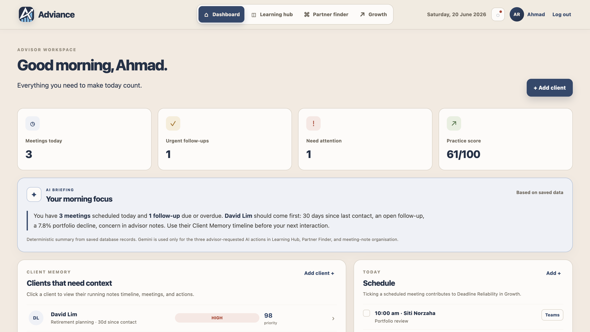
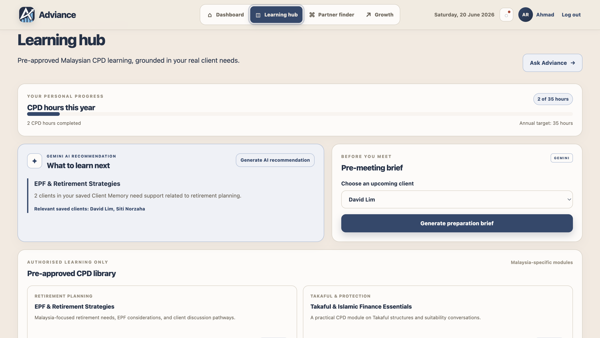
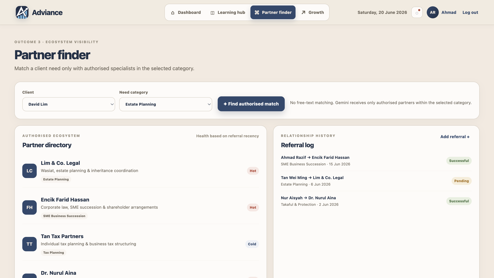
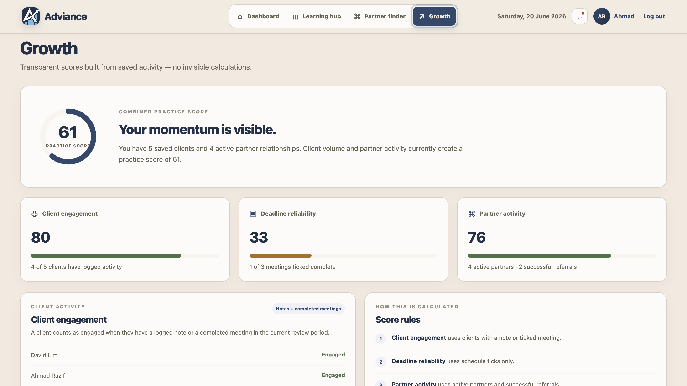

# Adviance

## Human Expertise Powered by AI

## Project Description

Adviance is a connected advisory workspace built around one central idea: **Client Memory**.

Every client has one persistent profile containing meeting notes, follow-ups, life events, referral history, and previous interactions. This information is stored in the backend database and becomes the shared source for Learning Hub, Partner Finder, and Growth Dashboard.

Adviance helps advisors organise client information, complete relevant CPD learning, find authorised specialist partners, and understand transparent growth indicators in one platform.

---

## Team Name

**Team LogicLords**

## Team Members

| Name                     | Role     |
| ------------------------ | -------- |
| Jeevika Akshaya          | Frontend |
| Shahriar Kabir Chowdhury | Backend  |
| Khan Rubayet Islam       | Frontend |
| Fariya                   | Pitching |
| Nikhil                   | Backend  |

---

## Challenge

Financial advisors often use separate systems for client records, meeting notes, CPD learning, schedules, and specialist referrals.

For example:

* A CRM stores client information.
* A calendar manages meetings.
* A learning platform provides CPD courses.
* A spreadsheet or personal contacts list stores partner referrals.

The problem is that these systems do not share context with each other. Advisors must manually remember what happened in client conversations, decide what knowledge they need next, and search for the right authorised partner.

---

## Our Approach

Adviance solves this fragmentation through **Client Memory**.

Client Memory is the persistent client profile that stores meeting notes, follow-ups, life events, meeting history, and referral records.

This one source then supports three connected outcomes:

### 1. Client Memory Dashboard

* Client profiles and meeting history
* Follow-up and schedule tracking
* Expense logging
* Gemini-assisted meeting note organisation
* Advisor-controlled review before saving AI output

### 2. Learning Hub

* CPD progress tracking toward the 35-hour yearly target
* Approved CPD course library
* AI course recommendations based on:

  * Client needs recorded in Client Memory
  * Completed courses
  * Advisor specialisation gaps
* Pre-meeting preparation brief

### 3. Partner Finder

* Authorised partner directory
* Need categories including tax, estate planning, Takaful, retirement, and business succession
* AI-supported partner matching
* AI-generated introduction-message draft
* Referral outcomes: Pending, Successful, or No Response

### 4. Growth Dashboard

* Client Engagement
* Deadline Reliability
* Partner Activity
* Practice Score

All Growth Dashboard indicators are transparent and based on visible advisor activity. They are not hidden AI scores.

---

## Why Adviance Is Different

CRMs store client records. Learning platforms store courses. Partner directories store contacts.

Adviance connects all three through one Client Memory.

A saved client conversation can help the advisor:

1. Prepare for the next meeting
2. Identify a relevant approved CPD course
3. Find an authorised specialist partner

Adviance is not another generic chatbot or separate CRM. It is a connected decision-support layer for advisory work.

---

## Technologies Used

### Frontend

* React
* Vite
* HTML
* CSS
* JavaScript

### Backend

* Node.js
* Express.js
* REST API

### Artificial Intelligence

* Google Gemini API

### Data Storage

* Local JSON database for MVP demonstration

### Security and Access

* Login and registration
* Environment variables using `.env`
* Gemini API key stored only in backend environment configuration
* Authorised partner and approved-course constraints
* Advisor review before acting on AI output

---

## AI Safety and Responsible Use

Gemini is used only as a support tool for:

* Organising rough meeting notes
* Suggesting possible follow-up actions
* Recommending courses from an approved CPD library
* Matching only from authorised partners
* Drafting introduction messages

Gemini does not provide investment advice, make financial decisions, automatically send messages, or overwrite client records.

The advisor reviews every AI-generated result before saving or acting on it.

---

## How to Run the Project Locally

### 1. Clone the repository

```bash
git clone https://github.com/Shahriar-101/Adviance-Team-LogicLords-ImagineHack-2026.git
```

### 2. Open the project folder

```bash
cd Adviance-Team-LogicLords-ImagineHack-2026
```

### 3. Install dependencies

```bash
npm install
```

### 4. Add environment variables

Inside the `backend` folder, create a file named:

```text
.env
```

Use `backend/.env.example` as a guide.

Add your own Gemini API key:

```env
GEMINI_API_KEY=your_gemini_api_key_here
GEMINI_MODEL=gemini-2.5-flash
PORT=4000
CORS_ORIGIN=http://localhost:5173
```

### 5. Start the application

```bash
npm run dev
```

Then open the local address shown in the Terminal, usually:

```text
http://localhost:5173
```

---

## Screenshots and Demo
## Screenshots and Demo

### Dashboard and Client Memory



### Learning Hub


### Partner Finder


### Growth Dashboard


## Demo Video

link: https://youtu.be/xdRJPid1maQ?si=8RJLN3CCOOmM_pIv

## AI Assistance Disclosure

AI tools were used to support development and documentation. Team LogicLords designed, reviewed, tested, integrated, and validated the final project.
